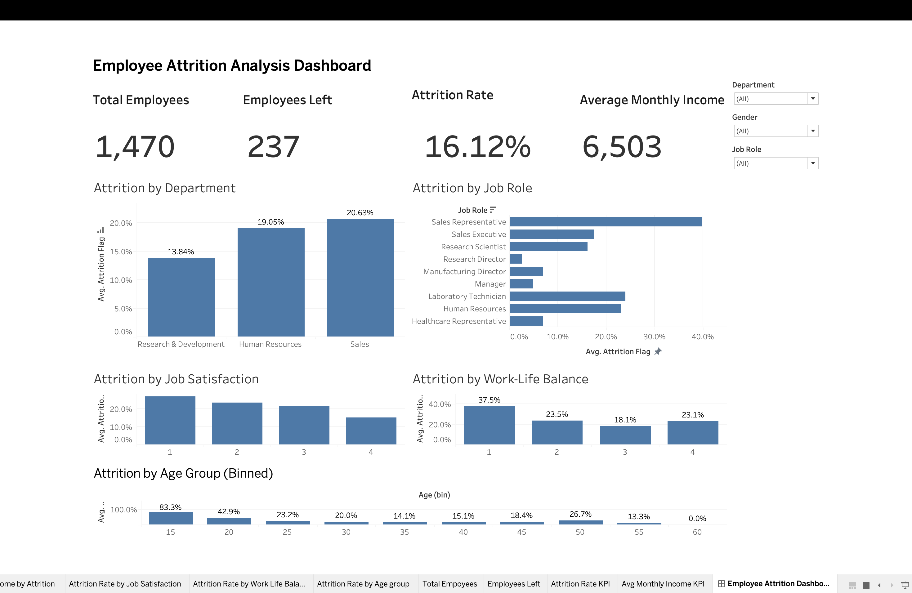

# HR Employee Attrition Analytics

A data analytics project that analyzes employee attrition using Python and Tableau to identify key factors influencing employee turnover and provide data-driven recommendations for improving employee retention.

## Dashboard Preview

## Technologies Used

- Python
- Pandas
- NumPy
- Matplotlib
- Seaborn
- Tableau
- Jupyter Notebook

## Project Structure

Employee-Attrition-Analytics/
│
├── README.md
├── Employee_Attrition_Analysis.ipynb
├── WA_Fn-UseC_-HR-Employee-Attrition.csv
├── dashboard.png

Key Insights

- Employees working overtime showed significantly higher attrition than those who did not.
- Sales Representatives experienced the highest employee attrition among all job roles.
- Employees aged 18–25 had the highest likelihood of leaving the organization.
- Lower monthly income was associated with higher employee attrition.
- Employees with job satisfaction level 4 also showed notable attrition, indicating that job satisfaction alone does not determine employee retention.

Business Recommendations

- Reduce excessive overtime by improving workload distribution and promoting work-life balance initiatives.
- Develop targeted retention programs for younger employees and high-risk job roles.
- Review compensation and career growth opportunities for employees with lower monthly income.
- Conduct regular employee feedback sessions to identify concerns before employees decide to leave.
- Use predictive analytics to identify employees at high risk of attrition and take proactive retention measures.
